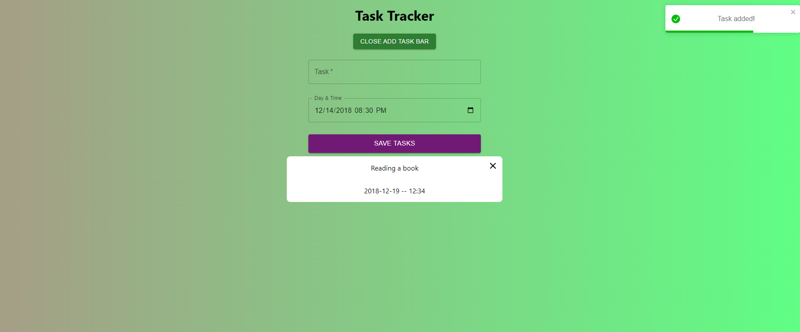

## Welcome! 👋

Thanks to visit my Github! This project is created with React pure CSS and toastify. Here is the link for this project (https://omer-cicek.github.io/task-tracker/)

**To do this project, i used basic React, CSS and Toastify.**

# Task Tracker

## Available Scripts

In the project directory, you can run:

### `npm install`
### `npm start`

## The challenge

Users should be able to:

- View the optimal layout for the site depending on their device's screen size
- See tasks and their time
- See warnings if try to add a task when its not existed.

## Got feedback for me?

Feedbacks are always improve my technical knowledge, so feel free to give me a feedback through my LinkedIn account (https://www.linkedin.com/in/omercicek97/) 🙌

**This Is What I Did!** 🚀
